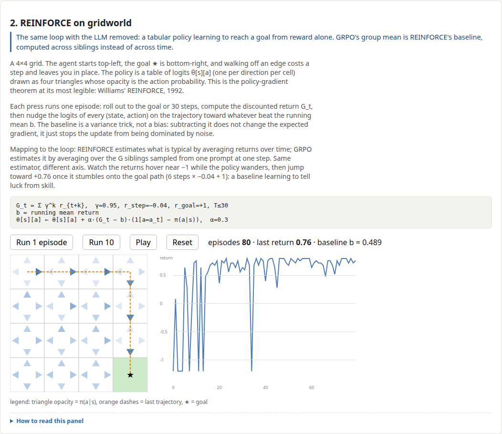
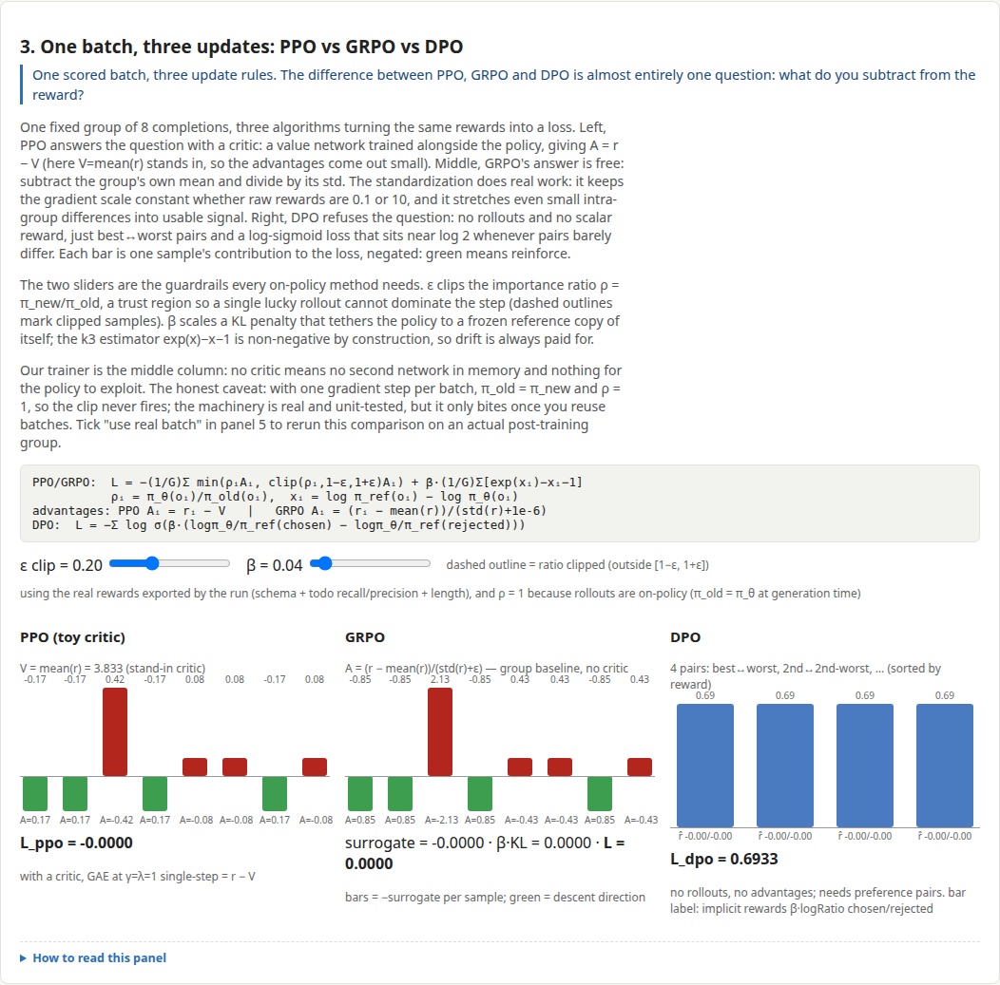
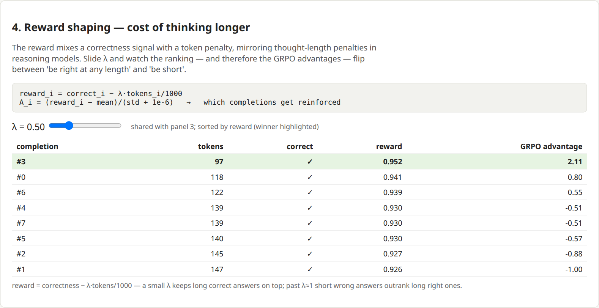
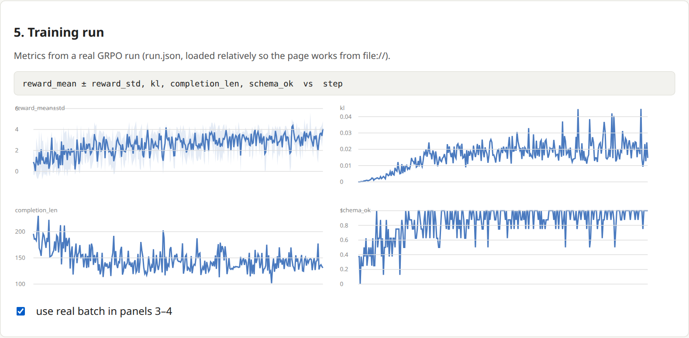

# Multi-turn Reinforcement Learning: GRPO from Scratch

This repo is a working, from-scratch implementation of RLVR (reinforcement
learning with *verifiable rewards*) applied to a small language model. The code includes both a training recipe for RLVR and a browser dashboard that animates what the algorithm is doing at each step.

The goal is to demonstrate the full loop end to end, with minimal framework
dependency, implementing the basic pieces from scratch where it improves
understanding. The flow, at a high level: prompts go in, the policy samples
a *group* of completions, a deterministic verifier scores each one,
advantages are computed relative to the group, and the policy is updated.
This code executes on my now-8-year-old GPU with 11 GB of VRAM and a small
model (Qwen2.5-0.5B-Instruct); the same code runs on larger models and most
modern commodity hardware.


*The dashboard's first panel: a toy policy over 8 completions, iterating
sample → reward → advantage → update. Watch the real thing at
`python3 -m http.server 4173 -d viz/dist` → http://localhost:4173*

## The concepts

**RLVR.** The expensive part of RLHF has always been the reward model. You
train a second network to judge outputs, and then you pray it isn't
exploitable. RLVR sidesteps that step for tasks where correctness is
*checkable by code*: math answers, code that passes tests, schema-conformant
extraction. A deterministic grader cannot be sweet-talked, so the reward
signal stays honest. The task in this repo is extraction-shaped. Given a
document, the model must emit `{summary, todos[]}` as strict JSON, graded
entirely by code.

**GRPO.** Group Relative Policy Optimization (from
[DeepSeekMath](https://arxiv.org/abs/2402.03300), popularized by
[DeepSeek-R1](https://arxiv.org/abs/2501.12948)). PPO needs a learned critic
to estimate a baseline. GRPO throws the critic away and uses the other
samples of the *same prompt* as the baseline instead:

```
A_i = (r_i − mean(r_group)) / std(r_group)      # advantage, per prompt group
loss = −mean(min(ratio·A, clip(ratio, 1±ε)·A)) + β·KL(π_θ, π_ref)
```

Completions that beat their siblings get pushed up; losers get pushed down.
There is no value network and no GAE. That matters in practice, because a
critic for a 0.5B model is another 0.5B parameters of things that can go
wrong.

**Multi-turn.** Single-turn RL trains one-shot completions. Multi-turn RL
trains trajectories: the model calls tools, reads results, and tries again.
Tokens produced by the environment are masked out of the loss, so the policy
is only trained on tokens it generated. This repo trains the single-turn
core, but the plumbing is built for the multi-turn version. The env contract
in [`train/envs/sim_env.py`](train/envs/sim_env.py) follows the OpenEnv-style
`reset`/`step` interface, and `data/harbor_tasks/` exports the same graded
tasks in [Harbor](https://www.harborframework.com) sandbox format for the
tool-using variant.

## What the demo shows

The dashboard (`viz/`, React+TS, fully static and deterministic) has five
panels:

1. **The loop** (the GIF above): a one-dimensional toy policy that visibly
   concentrates probability mass on high-reward completions. All 8
   completions come from the *same* prompt, and that shared prompt is
   exactly the "group" in group-relative. Watch the advantage bars flip
   between green and red while the policy bars gradually converge on the
   short, correct completions.

2. **Gridworld**: RL with no LLM at all. A tabular policy you can watch
   learn, which makes it the grounding case for everything else on the
   page. In the capture, returns hover near −1 while the policy wanders,
   then jump to about +0.5 once it stumbles onto the goal path, and the
   right/down arrows along that route visibly brighten. The running-mean
   baseline `b` plays the same role as GRPO's group mean, except it is
   computed over time rather than over siblings.

   

3. **PPO vs GRPO vs DPO**: the *same* batch of completions and rewards fed
   through all three update rules, with sliders for clip ε and KL β. The
   screenshot uses the real batch from the training run, and the contrast
   is the lesson. PPO's stand-in critic produces tiny ±0.01 advantages.
   GRPO's group standardization stretches the same rewards out to −2.11
   and +1.00. DPO sits at a flat 0.69 loss because it only ever sees
   preference pairs, not rewards. The takeaway is that GRPO amplifies
   intra-group differences, which is powerful when the group has spread
   and degenerate when every rollout scores the same.

   

4. **Reward shaping**: the reward mixes correctness with a token cost
   (`reward = correctness − λ·tokens`), and the λ slider lets you watch
   which completions win. In this real batch every completion was already
   correct, so at λ=0.5 the ranking is decided entirely by length, and the
   shortest answer (#3, 97 tokens) takes the top advantage (+2.11). Reward
   design *is* policy design.

   

5. **Training results**: the actual metrics from the training run in this
   repo (`viz/dist/run.json`). The four curves tell the whole story in
   miniature. Reward climbs, `schema_ok` saturates, `completion_len`
   shrinks from ~190 to ~130 as rambling stops paying, and KL rises and
   then plateaus near 0.02 nats. This is the same ordering the eval table
   shows: format first, then content.

   

## The task and the reward

Input: a document (email thread, meeting notes, chat log). Output contract:

```json
{
  "summary": "<= 60 words",
  "todos": [{"task": "...", "owner": "name|null", "due": "YYYY-MM-DD|null", "priority": "high|med|low"}]
}
```

[`train/reward/core.py`](train/reward/core.py) is a weighted sum of
verifiable terms: schema validity, todo recall and precision against gold
(matched by token-F1), owner accuracy, a length budget, and a hallucination
penalty for emitting owners or dates absent from the source. It is written
like a compiler because it *is* the attack surface. Precision is gated on
recall so that emitting zero todos cannot farm a free point, and every term
has an adversarial unit test.

The dataset is synthetic (`data/gen_docs.py`). Gold todos are known because
the generator injects them. 2k train / 200 eval, checked in as parquet.

## The training loop

[`train/tier_a/grpo_minimal.py`](train/tier_a/grpo_minimal.py) is the core of
the repo: roughly 230 lines, with no framework between you and the tensors.

- Group-standardized advantages (G=4 completions per prompt)
- Per-token clipped surrogate objective
- A k3 KL estimator (`exp(x) − x − 1`) against a reference policy obtained
  by disabling the LoRA adapter on the same weights, so no second model
  sits in VRAM
- One honest caveat worth understanding: with a single gradient step per
  batch, `logp_old == logp_new`, so the ratio is identically 1 and the clip
  never fires. The machinery is real and unit-tested, but it only *bites*
  once you reuse batches, which is the next experiment.

[`train/tier_a/grpo_trl.py`](train/tier_a/grpo_trl.py) runs the same task
through TRL's `GRPOTrainer` as a cross-check that the hand-written loop
produces the same learning curve.

## Results

300 steps of `Qwen2.5-0.5B-Instruct`, LoRA r=16, B=2 prompts × G=4
completions, fp32, at roughly 11 seconds per step. Under an hour of compute
on the reference card:

| metric (32-doc eval) | before | after |
|---|---|---|
| schema_ok rate | 0.22 | 1.00 |
| todo recall (F1-match) | 0.11 | 0.44 |
| mean reward | 0.69 | 3.36 |


Three things are worth noticing. `schema_ok` saturates by around step 200:
the model learns the format quickly and then spends the rest of the run
grinding on content recall, which is exactly what the format/content split
in the reward is designed to produce. Completion length drifts from ~190 to
~130 tokens as rambling stops paying. KL climbs to ~0.02 nats and then
plateaus, meaning the policy moves while staying tethered to the base model.

## Running it

```bash
uv python install 3.12
uv sync --extra tier-a
uv run python scripts/preflight.py           # asserts GPU/torch/arch compatibility
uv run pytest -q                             # reward, data, and loop unit tests

uv run python -m train.tier_a.grpo_minimal --config configs/tier_a_grpo.yaml
# short smell test: add --set grpo.steps=50
uv run python scripts/plot_curves.py --runs runs/tier_a --copy-run-json viz/dist/run.json
```

Each run writes `metrics.jsonl`, `run.json` (dashboard panel-5 schema),
`samples.jsonl`, `eval_before/after.json`, and LoRA checkpoints under
`runs/<name>/`.

**Hardware notes.** The reference run used a GTX 1080 Ti (Pascal, compute
capability 6.1, 11 GB). vLLM is a no-go there because it requires CC ≥ 7.x,
and `torch 2.14.0+cu126` is the last wheel line that ships `sm_61` kernels,
so it is pinned in `pyproject.toml` and asserted by `scripts/preflight.py`.
Any GPU with ~11 GB and CC ≥ 6.1 works; newer cards can simply crank
`num_generations` and `steps`. On CPU, run the smoke test in the Setup
section below.

**Deploying the dashboard.** `viz/dist/` is a static site. See
[`deploy/`](deploy/README.md) for a one-command deploy to a free-tier cloud
VM (Caddy, with automatic HTTPS once you point a domain at it).

## Where this goes next

Since part 1 is focused on concept understanding, the eval set is small
(n=32) and synthetic, the loop takes one gradient step per batch so the clip
never actually fires, and there's no judge term for summary quality. We will
extend this demo with a real-world use case in Part 2.

Part 2 uses the same frame as part 1 but applied to an AI note-keeping app
I started developing a week ago: I keep a large pile of notes, some
human-written, some machine-written, and the tasks I care about are
*summarize this*, *pull out the action items*, and *answer my question
against these notes and show me which note it came from*. An end-to-end
working version of that, trained with RL, is the next repo.

On a high-level we will extend our current code by:

- **Making the environment real.** `train/envs/sim_env.py` is a single-step
  shell of the OpenEnv `reset`/`step` contract. In part 2 it gets backed by
  the notes app's actual API, with tools like `search_notes(query)`,
  `read_note(id)`, and `cite(note_id)`. An episode stops being one-shot and
  becomes a trajectory: the model learns *when* to search, what to open,
  and when it has enough to answer. That is the "multi-turn" in the title
  earning its keep. Tool results get env-masked out of the loss, so the
  policy only trains on tokens it generated.
- **Generalizing the verifier.** The grader in `train/reward/core.py`
  already checks action-item recall; for Q&A the checkable signal becomes
  "did it cite note IDs that exist, and do those notes contain the answer."
  Still deterministic, still no reward model needed, so the RLVR premise
  carries over unchanged.
- **Getting serious about the hallucination penalty.** Citing a note that
  does not exist is the failure mode that makes this kind of app useless,
  and it is exactly what a verifiable reward is good at training away.
- **Swapping synthetic tasks for a real corpus.** The Harbor task export
  (`data/harbor_tasks/`) keeps its format; the tasks underneath become real
  notes instead of generated docs. Same grader, real data.

## Repo map

```
train/tier_a/grpo_minimal.py   hand-written GRPO loop (the core)
train/tier_a/grpo_trl.py       same task through TRL's GRPOTrainer
train/reward/core.py           stdlib-only verifiable reward
train/envs/sim_env.py          single-step env contract + gridworld
data/gen_docs.py               synthetic doc/todo generator (+ Harbor export)
viz/                           dashboard source (React+TS); dist/ is committed
scripts/preflight.py           GPU/arch/pin assertions, run first
scripts/plot_curves.py         metrics → curves + run.json for panel 5
deploy/                        serve the dashboard on a free-tier VM
docs/design.md                 design notes: constraints, tradeoffs, open questions
docs/loop-demo.gif             the GIF above (captured from the real dashboard)
```

## References that were actually useful

- [DeepSeekMath](https://arxiv.org/abs/2402.03300), the paper that introduced GRPO
- [DeepSeek-R1](https://arxiv.org/abs/2501.12948), RLVR working at scale
- [PPO](https://arxiv.org/abs/1707.06347) and [DPO](https://arxiv.org/abs/2305.18290), the baselines panel 3 compares against
- Jimmy Shi, [*a vision researcher's guide to PPO & GRPO*](https://yugeten.github.io/posts/2025/01/ppogrpo), the clearest derivation I found
- Cameron Wolfe's [GRPO](https://cameronrwolfe.substack.com/p/grpo) and [GRPO tricks](https://cameronrwolfe.substack.com/p/grpo-tricks)
- [TRL GRPOTrainer](https://huggingface.co/docs/trl/en/grpo_trainer) · [TRL Harbor](https://huggingface.co/docs/trl/en/harbor) · [TRL OpenEnv](https://huggingface.co/docs/trl/en/openenv)

## Setup details

Data is checked in (`data/train.parquet`, `data/eval.parquet`). Regenerate:

```bash
uv run python -m data.gen_docs --parquet data/ --n-train 2000 --n-eval 200 --seed 0
uv run python -m data.gen_docs --harbor data/harbor_tasks/sample --n 5 --seed 0 --split eval
```

CPU smoke test (no GPU, tiny model, 2 steps):

```bash
uv run python -m train.tier_a.grpo_minimal --config configs/tier_a_grpo.yaml \
  --set model=HuggingFaceTB/SmolLM2-360M-Instruct \
  --set grpo.steps=2 --set grpo.num_generations=2 \
  --set grpo.max_completion_length=32 --set grpo.batch_prompts=1 \
  --set data.eval_n=2 --device cpu
```

Dashboard dev/build:

```bash
cd viz && npm install && npm run test && npm run build
```

License: Apache-2.0.
