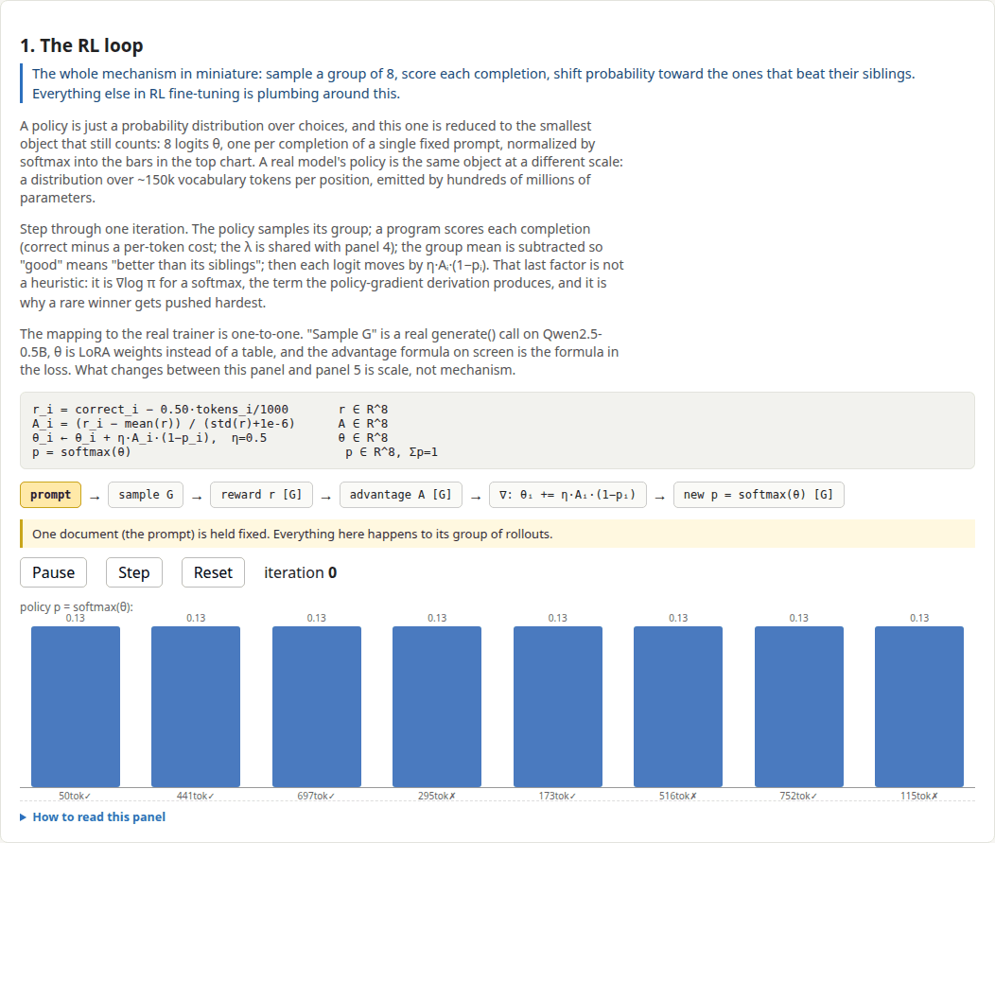
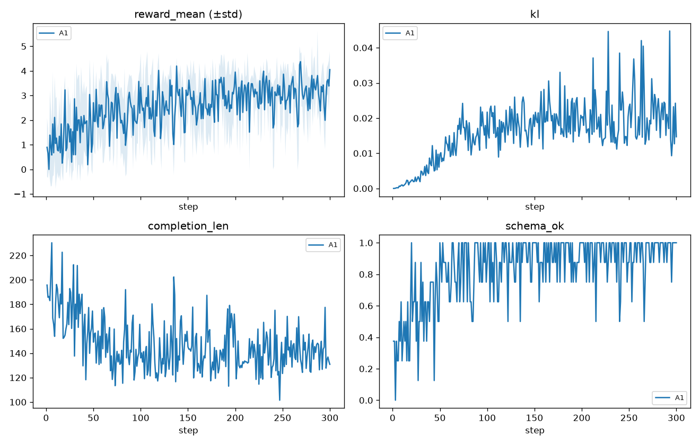

# Multi-turn Reinforcement Learning: GRPO from Scratch

This repo is a working, from-scratch implementation of RLVR (reinforcement
learning with *verifiable rewards*) applied to a small language model. The code includes both a training recipe for RLVR and a browser dashboard that animates what the algorithm is doing at each step.

The goal is to demonstrate the full loop end to end, with minimal framework dependency, implement basic class from scatch if required to improve understanding. The flow is on a high-level: prompts go in, the policy samples a *group* of
completions, a deterministic verifier scores each one, advantages are
computed relative to the group, and the policy is updated. This code excutes on my now 8 year old GPU with 11GB of RAM for a small model (Qwen2.5 5B instruct), you should be able to run this same code on larger models and with most modern commodity GPUs.



*The dashboard's first panel: a toy policy over 8 completions, iterating
sample → reward → advantage → update. Watch the real thing at
`python3 -m http.server 4173 -d viz/dist` → http://localhost:4173*

## The concepts

**RLVR.** The expensive part of RLHF has always been the reward model: you
train a second network to judge outputs, then pray it isn't exploitable.
RLVR sidesteps that for tasks where correctness is *checkable by code* —
math answers, test-passing code, schema-conformant extraction. A
deterministic grader can't be sweet-talked, so the reward signal stays
honest. This repo's task is extraction-shaped: given a document, emit
`{summary, todos[]}` as strict JSON, graded entirely by code.

**GRPO.** Group Relative Policy Optimization (from
[DeepSeekMath](https://arxiv.org/abs/2402.03300), popularized by
[DeepSeek-R1](https://arxiv.org/abs/2501.12948)). PPO needs a learned critic
to estimate a baseline; GRPO throws the critic away and uses the other
samples of the *same prompt* as the baseline instead:

```
A_i = (r_i − mean(r_group)) / std(r_group)      # advantage, per prompt group
loss = −mean(min(ratio·A, clip(ratio, 1±ε)·A)) + β·KL(π_θ, π_ref)
```

Completions that beat their siblings get pushed up; losers get pushed down.
No value network, no GAE — which matters, because a critic for a 0.5B model
is another 0.5B of things to go wrong.

**Multi-turn.** Single-turn RL trains one-shot completions. *Multi-turn* RL
trains trajectories: the model calls tools, reads results, and tries again —
with environment-produced tokens masked out of the loss (the policy is only
trained on tokens it generated). This repo trains the single-turn core, but
the plumbing is built for the multi-turn version: the env contract in
[`train/envs/sim_env.py`](train/envs/sim_env.py) follows the OpenEnv-style
`reset`/`step` interface, and `data/harbor_tasks/` exports the same graded
tasks in [Harbor](https://www.harborframework.com) sandbox format for the
tool-using variant.

## What the demo shows

The dashboard (`viz/`, React+TS, fully static and deterministic) has five
panels:

1. **The loop** (the GIF above) — a 1-d toy policy visibly concentrating
   probability mass on high-reward completions.
2. **Gridworld** — RL with no LLM at all: a tabular policy you can watch
   learn. The grounding case.
3. **PPO vs GRPO vs DPO** — the *same* batch of completions and rewards fed
   through all three update rules, with sliders for clip ε and KL β.
4. **Reward shaping** — reward = correctness − λ·tokens; slide λ and watch
   which completions win.
5. **The real run** — the actual metrics from the training run in this repo
   (`viz/dist/run.json` is the genuine output, not a mock).

## The task and the reward

Input: a document (email thread, meeting notes, chat log). Output contract:

```json
{
  "summary": "<= 60 words",
  "todos": [{"task": "...", "owner": "name|null", "due": "YYYY-MM-DD|null", "priority": "high|med|low"}]
}
```

[`train/reward/core.py`](train/reward/core.py) is a weighted sum of
verifiable terms — schema validity, todo recall/precision against gold
(matched by token-F1), owner accuracy, a length budget, and a hallucination
penalty for emitting owners or dates absent from the source. It's written
like a compiler because it *is* the attack surface: precision is gated on
recall so emitting zero todos can't farm a free point, and every term has an
adversarial unit test.

The dataset is synthetic (`data/gen_docs.py`) — gold todos are known because
the generator injects them. 2k train / 200 eval, checked in as parquet.

## The training loop

[`train/tier_a/grpo_minimal.py`](train/tier_a/grpo_minimal.py) — ~230 lines,
no framework between you and the tensors:

- Group-standardized advantages (G=4 completions per prompt)
- Per-token clipped surrogate objective
- k3 KL estimator (`exp(x) − x − 1`) against a reference policy obtained by
  disabling the LoRA adapter on the same weights — no second model in VRAM
- One honest caveat worth understanding: with a single gradient step per
  batch, `logp_old == logp_new`, so the ratio is identically 1 and the clip
  never fires. The machinery is real and unit-tested; it only *bites* once
  you reuse batches — which is the next experiment.

[`train/tier_a/grpo_trl.py`](train/tier_a/grpo_trl.py) runs the same task
through TRL's `GRPOTrainer` as a cross-check that the hand-written loop
produces the same learning curve.

## Results

300 steps, `Qwen2.5-0.5B-Instruct`, LoRA r=16, B=2 prompts × G=4
completions, fp32, ~11 s/step — under an hour of compute:

| metric (32-doc eval) | before | after |
|---|---|---|
| schema_ok rate | 0.22 | 1.00 |
| todo recall (F1-match) | 0.11 | 0.44 |
| mean reward | 0.69 | 3.36 |



Three things worth noticing: `schema_ok` saturates by ~step 200 (format is
learned fast, then the run grinds on content recall — exactly what the
format/content reward split is designed to produce); completion length
drifts from ~190 to ~130 tokens as rambling stops paying; and KL climbs to
~0.02 nats then plateaus — the policy moves while staying tethered to the
base model.

## Running it

```bash
uv python install 3.12
uv sync --extra tier-a
uv run python scripts/preflight.py           # asserts GPU/torch/arch compatibility
uv run pytest -q                             # reward, data, and loop unit tests

uv run python -m train.tier_a.grpo_minimal --config configs/tier_a_grpo.yaml
# short smell test: add --set grpo.steps=50
uv run python scripts/plot_curves.py --runs runs/tier_a --copy-run-json viz/dist/run.json
```

Each run writes `metrics.jsonl`, `run.json` (dashboard panel-5 schema),
`samples.jsonl`, `eval_before/after.json`, and LoRA checkpoints under
`runs/<name>/`.

**Hardware notes.** The reference run used a GTX 1080 Ti (Pascal, CC 6.1,
11 GB). That's why there's no vLLM: it needs CC ≥ 7.x, and `torch
2.14.0+cu126` is the last wheel line shipping `sm_61` kernels — pinned in
`pyproject.toml`, asserted by `scripts/preflight.py`. Any GPU with ~11 GB
and CC ≥ 6.1 works; newer cards can crank `num_generations` and `steps`.
On CPU, run the smoke test in the Setup section below.

**Deploying the dashboard.** `viz/dist/` is a static site — see
[`deploy/`](deploy/README.md) for a one-command deploy to a free-tier cloud
VM (Caddy, auto-HTTPS once you point a domain at it).

## Honest limitations / what's next

- Eval is small (n=32) and the data is synthetic — recall 0.44 is real
  progress, not a solved task.
- Single update per batch (see caveat above); minibatch reuse with real
  off-policy correction is where the clip earns its keep.
- No judge term — a second LM grading summary quality is the obvious
  extension and the obvious reward-hacking surface. Deliberately off.
- The multi-turn variant (Harbor sandboxes, tool calls, env-token masking)
  is scaffolded but not yet wired to a trainer — that's part two.

## Repo map

```
train/tier_a/grpo_minimal.py   hand-written GRPO loop (the core)
train/tier_a/grpo_trl.py       same task through TRL's GRPOTrainer
train/reward/core.py           stdlib-only verifiable reward
train/envs/sim_env.py          single-step env contract + gridworld
data/gen_docs.py               synthetic doc/todo generator (+ Harbor export)
viz/                           dashboard source (React+TS); dist/ is committed
scripts/preflight.py           GPU/arch/pin assertions — run first
scripts/plot_curves.py         metrics → curves + run.json for panel 5
deploy/                        serve the dashboard on a free-tier VM
docs/design.md                 design notes: constraints, tradeoffs, open questions
docs/loop-demo.gif             the GIF above (captured from the real dashboard)
```

## References that were actually useful

- [DeepSeekMath](https://arxiv.org/abs/2402.03300) — where GRPO comes from
- [DeepSeek-R1](https://arxiv.org/abs/2501.12948) — RLVR at scale
- [PPO](https://arxiv.org/abs/1707.06347) · [DPO](https://arxiv.org/abs/2305.18290)
- Jimmy Shi, [*a vision researcher's guide to PPO & GRPO*](https://yugeten.github.io/posts/2025/01/ppogrpo) — clearest derivation I found
- Cameron Wolfe's [GRPO](https://cameronrwolfe.substack.com/p/grpo) and [GRPO tricks](https://cameronrwolfe.substack.com/p/grpo-tricks)
- [TRL GRPOTrainer](https://huggingface.co/docs/trl/en/grpo_trainer) · [TRL Harbor](https://huggingface.co/docs/trl/en/harbor) · [TRL OpenEnv](https://huggingface.co/docs/trl/en/openenv)

## Setup details

Data is checked in (`data/train.parquet`, `data/eval.parquet`). Regenerate:

```bash
uv run python -m data.gen_docs --parquet data/ --n-train 2000 --n-eval 200 --seed 0
uv run python -m data.gen_docs --harbor data/harbor_tasks/sample --n 5 --seed 0 --split eval
```

CPU smoke test (no GPU, tiny model, 2 steps):

```bash
uv run python -m train.tier_a.grpo_minimal --config configs/tier_a_grpo.yaml \
  --set model=HuggingFaceTB/SmolLM2-360M-Instruct \
  --set grpo.steps=2 --set grpo.num_generations=2 \
  --set grpo.max_completion_length=32 --set grpo.batch_prompts=1 \
  --set data.eval_n=2 --device cpu
```

Dashboard dev/build:

```bash
cd viz && npm install && npm run test && npm run build
```

License: Apache-2.0.
